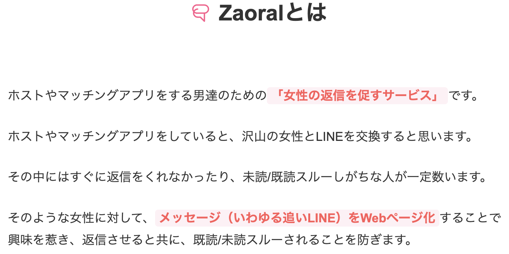

# Zaoral 

[English](README_EN.md) | [中文](README_ZH.md)

詳細はアプリ内ページ参照: [https://zaoral.vercel.app/zaoral](https://zaoral.vercel.app/zaoral)

## 初版作成

2025.9

## 作成期間

不明（作成中に色々あったので）

## 機能

- **ユーザ認証**: Google OAuthによるログイン
- **メッセージ作成**: 簡単なメッセージ作成と公開機能
- **プロジェクト管理**: ダッシュボードにて作成したプロジェクトの確認/削除

※ 詳細は[要件定義書](https://github.com/So-213/Zaoral/blob/master/%E8%A6%81%E4%BB%B6%E5%AE%9A%E7%BE%A9%E6%9B%B8.md)及び[詳細設計書](https://github.com/So-213/Zaoral/blob/master/%E8%A9%B3%E7%B4%B0%E8%A8%AD%E8%A8%88%E6%9B%B8.md)参照

## アプリの様子

**ホーム画面**

**空のダッシュボード**

**メッセージ作成画面**

**公開されたメッセージ画面**

**ダッシュボード画面**