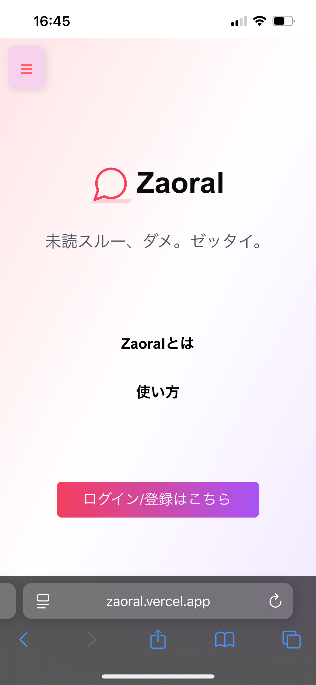
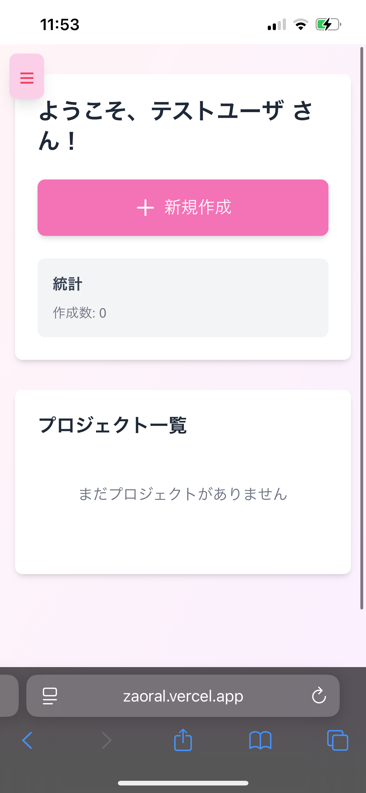
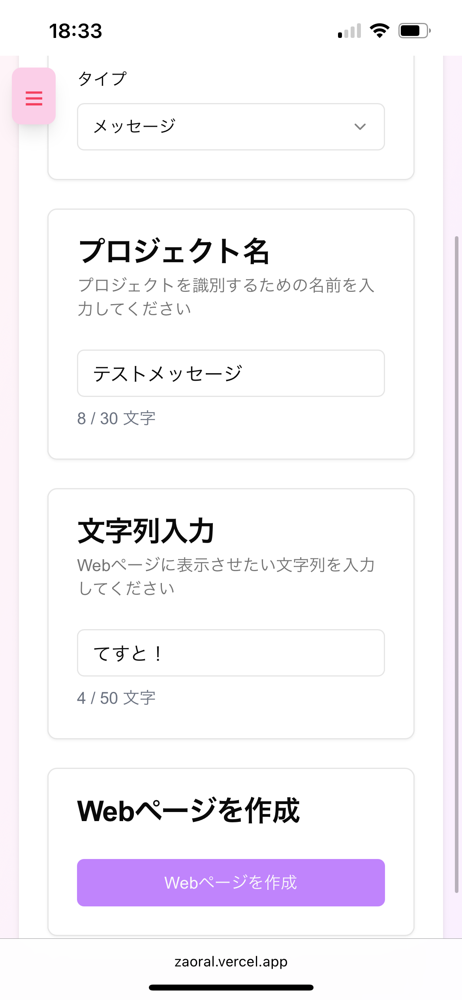
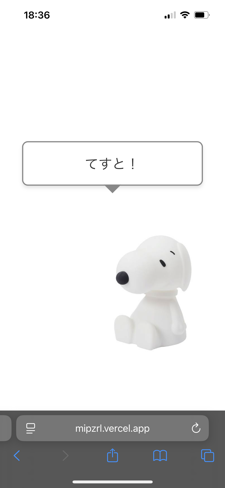
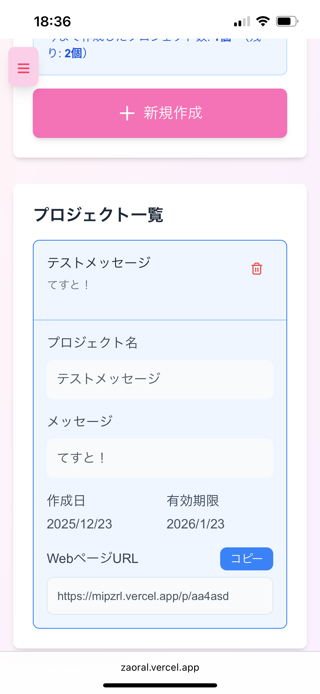

# Zaoral 

Zaoralは「追いLINEを確実に読んでもらうためにWebページ化するアプリケーション」です. 

ユーザはメッセージを作成し, Web上に公開することで, 相手の注意を引くようなメッセージを届けることができます.

詳細はアプリ内のページを参照: [https://zaoral.vercel.app/zaoral](https://zaoral.vercel.app/zaoral)

## 初版作成

2025.9

## 作成期間

不明（作成中に色々あったので）

## 機能

- **ユーザ認証**: Google OAuthによるログイン
- **メッセージ作成**: 簡単なメッセージ作成と公開機能
- **プロジェクト管理**: ダッシュボードにて作成したプロジェクトの確認/削除

## アプリの様子

**ホーム画面**

**空のダッシュボード**

**メッセージ作成画面**

**公開されたメッセージ画面**

**ダッシュボード画面**

