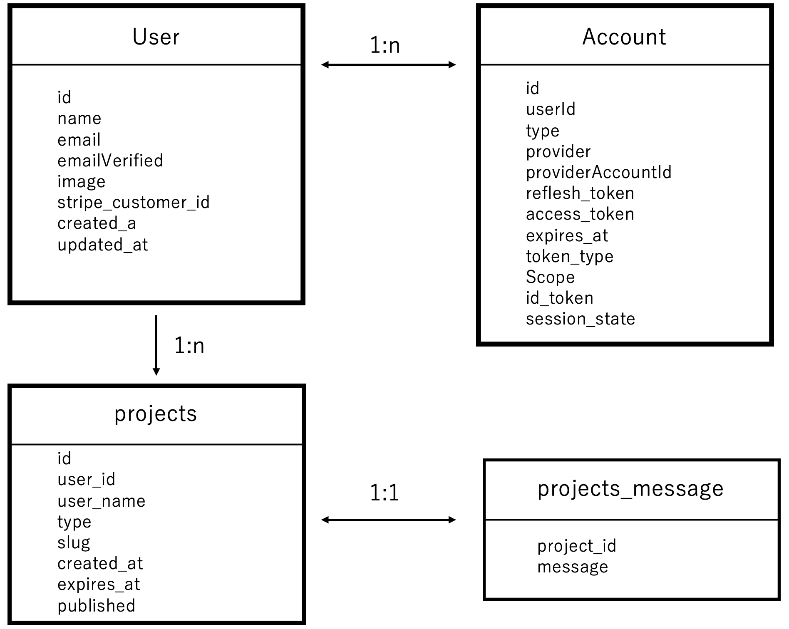

# Zaoral 

Zaoralは「追いLINEを確実に読んでもらうためにWebページ化するアプリケーション」です. 

ユーザはメッセージを作成し, Web上に公開することで, 受信者に確実にメッセージを届けることができます.

## 初版作成

2025.9

## 作成期間

不明（作成中に色々あったので）

## 機能

- **ユーザ認証**: Google OAuthによるログイン
- **メッセージ作成**: 簡単なメッセージ作成と公開機能
- **プロジェクト管理**: ダッシュボードにて作成したプロジェクトの確認/削除

## 技術スタック

### フロントエンド
- **Next.js 14** - React フレームワーク
- **TypeScript** - 型安全性
- **Tailwind CSS** - スタイリング
- **NextAuth.js** - 認証システム

### バックエンド・データベース
- **Prisma** - ORM
- **PostgreSQL** - データベース
- **NextAuth.js** - 認証プロバイダー

## ER図（PostgreSQL）

